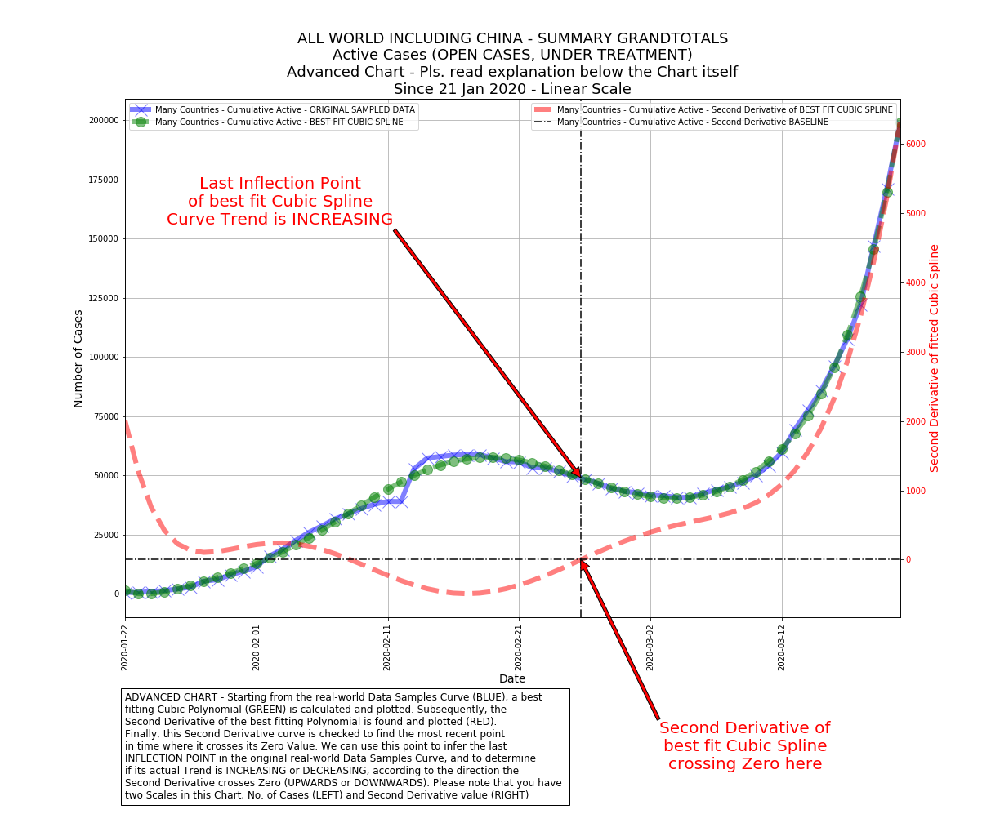
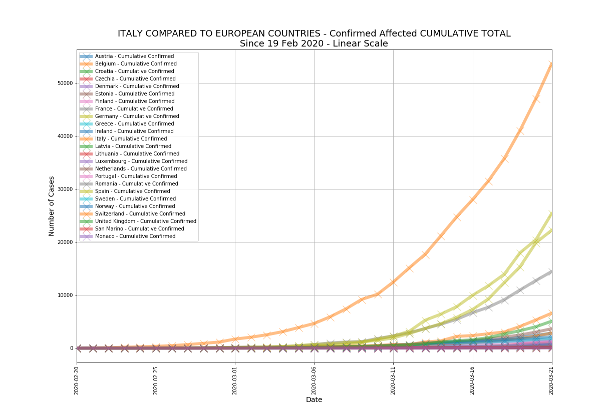
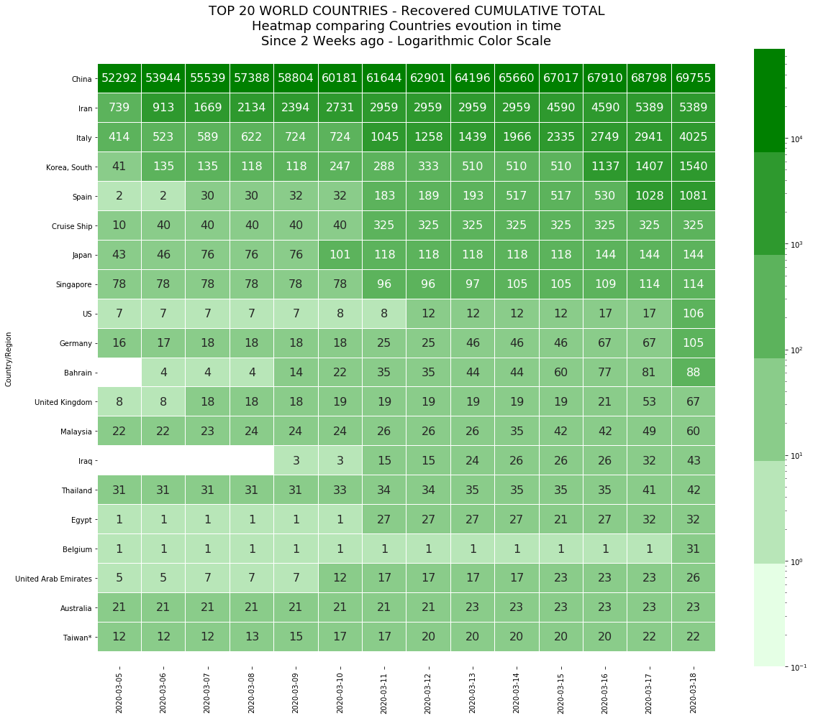
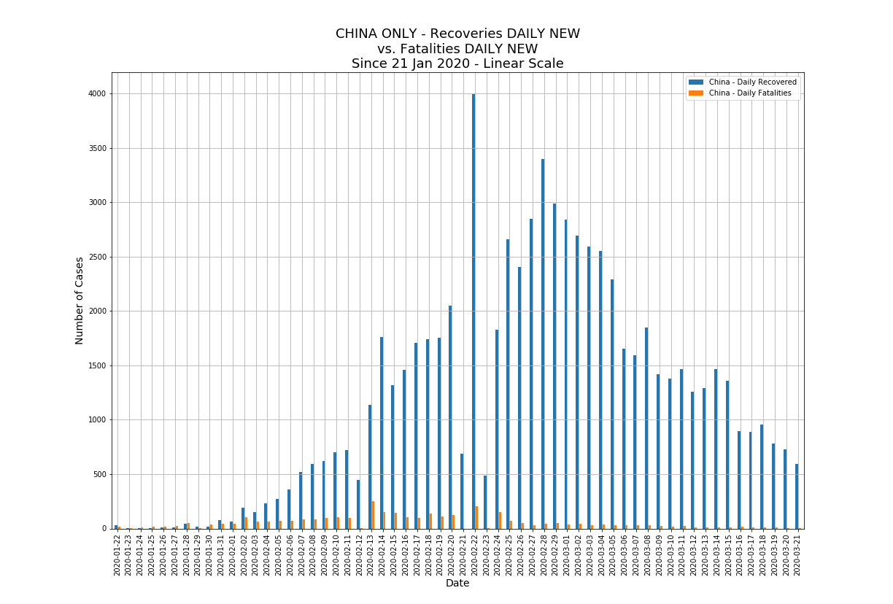
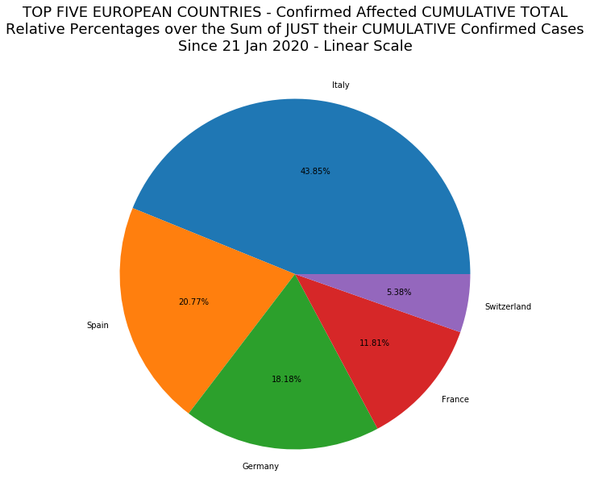

# covid-19-charts
Jupyter Notebook and tools to generate charts and stats related to COVID-19 spread

### View the live Site with the latest data:
First of all, you can quickly check the live web page that I update on a daily basis showing COVID-19 charts generated using the code shared in this Git Repository. It's up and running at this URL:

https://r-lomba.github.io/covid-19-charts/charts

<a href="https://r-lomba.github.io/covid-19-charts/charts"></a>

### Project description:
This project relies on COVID-19 data made publicly available by Johns Hopkins University CSSE in their Git Repository (see URL reference at the bottom of this page)

The main file in this project is "covid-19.ipynb", a Jupyter Notebook in Python containing code that enables you to perform the following tasks:

- Read the original data feed @JHU CSSE and populates the internal data engine with fresh COVID-19 data
- Allows you to easily generate on-the-fly a variety of charts from the COVID-19 data collected at the previous step, aggregating in non-trivial ways, using just one single call to a function with a few parameters
- Some of the charts you can generate are very peculiar, e.g. automatically fitting a cubic polynomial to data samples aggregated in creative ways and drawing the second derivative of that fitted polynomial. This is incredibly useful to catch changes in trends when they are not yet "visible to the naked eye", by looking at when and how the second derivative intersects the zero-baseline (upwards or downwards)
- Chart types currently available are: Line, Bar, Pie, Heatmap, Advanced
- Save generated charts in PNG format inside a "charts" subdirectory, together with a simple auto-generated "index.html" page to directly show the charts in a browser
- The last step allows you to easily publish the generated charts on e.g. a public webserver

If you open the Notebook in GitHub, on top of it you'll find an "Open in Google Colab" icon. Clicking on this icon opens up a dedicated live Google Colab instance with a copy of the Notebook, allowing you to immediately execute and try the code live

### Why you should be interested in all this:
Because you can easily present data starting from 8 aggregated Pandas Dataframe sources:

- Cumulative Active cases
- Daily Active (new cases)
- Cumulative Confirmed cases
- Daily Confirmed (new cases)
- Cumulative Recoveries
- Daily Recoveries (new cases)
- Cumulative Fatalities
- Daily Fatalities (new cases)

### For instance, you could decide to:
```python
# LET'S PLOTS A COMPLETE CHART!
# CHOOSE DATAFRAMES OF INTEREST FOR THIS PARTICULAR CHART
# THEY WILL BE PUT IN A DICTIONARY HOLDING THEM ALL
# DICTIONARY KEYS ARE THE LEGEND ENTRIES THAT WILL BE PLOTTED
dict_of_dataframes = {}
dict_of_dataframes['Cumulative Confirmed'] = confirmed_DF

# CHOOSE A LIST OF COUNTRIES FOR THIS PARTICULAR CHART
# THE LIST CAN BE EXPLICIT OR CAN BE A REFERENCE TO PREVIOUSLY INITIALIZED LISTS
list_of_countries = list_of_countries_europe

# CHOOSE A START DATE FOR THIS PARTICULAR CHART
# FORMAT MUST MATCH 'YYYY-MM-DD' OR BE AN INTEGER FOR SYSDATE-X DAYS
start_date = '2020-02-19'

# CHOOSE A TITLE FOR THIS THIS PARTICULAR CHART
title = 'ITALY COMPARED TO EUROPEAN COUNTRIES - Confirmed Affected CUMULATIVE TOTAL' + \
        '\n' + \
        'Since 19 Feb 2020 - Linear Scale'

# CHOOSE A SCALE TYPE FOR THIS THIS PARTICULAR CHART
# VALID VALUES ARE 'plain' OR 'log'
scale_type = 'plain'

# CHOOSE WHETHER YOU WANT TO TOTALIZE DATA ACROSS MULTIPLE NATIONS IN THE SPECIFIED LIST
# OR IF YOU WANT SEPARATE CHARTS FOR EACH NATION
# VALID VALUES ARE 'Y' OR 'N'
flg_totalize_countries = 'N'

# INDICATE HOW MANY RECORDS YOU WANT TO KEEP FROM THE TOP RANKED DOWN
# USEFUL FOR HEATMAPS. PUT ZERO FOR ALL RECORDS. DEFAULT 10
num_ranked = 0

# INDICATE IF YOU WANT TO DRAW AN ADVANCED CHART E.G. WITH CUBIC POLYNOMIAL FITTING
# SECOND DERIVATIVES, INFLECTION POINTS AND ROOT POINTS. DEFAULT 'N'
flg_advanced_chart = 'N'

# LET'S PLOT!
plot_complete_chart(
list_of_countries,
start_date, 
title,
scale_type,
dict_of_dataframes,
dict_of_charttypes,
flg_totalize_countries,
num_ranked,
flg_advanced_chart)
```

And get the following result:

<a href="demo-images/02_image.png"></a>

### Or you could decide to:
```python
# LET'S PLOTS A COMPLETE CHART!
# CHOOSE DATAFRAMES OF INTEREST FOR THIS PARTICULAR CHART
# THEY WILL BE PUT IN A DICTIONARY HOLDING THEM ALL
# DICTIONARY KEYS ARE THE LEGEND ENTRIES THAT WILL BE PLOTTED
dict_of_dataframes = {}
dict_of_dataframes['Cumulative Recovered Heatmap'] = recovered_heatmap_DF

# CHOOSE A LIST OF COUNTRIES FOR THIS PARTICULAR CHART
# THE LIST CAN BE EXPLICIT OR CAN BE A REFERENCE TO PREVIOUSLY INITIALIZED LISTS
list_of_countries = list_of_countries_world

# CHOOSE A START DATE FOR THIS PARTICULAR CHART
# FORMAT MUST MATCH 'YYYY-MM-DD' OR BE AN INTEGER FOR SYSDATE-X DAYS
start_date = 14

# CHOOSE A TITLE FOR THIS THIS PARTICULAR CHART
title = 'TOP 20 WORLD COUNTRIES - Recovered CUMULATIVE TOTAL' + \
        '\n' + \
        'Heatmap comparing Countries evoution in time' + \
        '\n' + \
        'Since 2 Weeks ago - Logarithmic Color Scale'

# CHOOSE A SCALE TYPE FOR THIS THIS PARTICULAR CHART
# VALID VALUES ARE 'plain' OR 'log'
scale_type = 'log'

# CHOOSE WHETHER YOU WANT TO TOTALIZE DATA ACROSS MULTIPLE NATIONS IN THE SPECIFIED LIST
# OR IF YOU WANT SEPARATE CHARTS FOR EACH NATION
# VALID VALUES ARE 'Y' OR 'N'
flg_totalize_countries = 'N'

# INDICATE HOW MANY RECORDS YOU WANT TO KEEP FROM THE TOP RANKED DOWN
# USEFUL FOR HEATMAPS. PUT ZERO FOR ALL RECORDS. DEFAULT 10
num_ranked = 20

# INDICATE IF YOU WANT TO DRAW AN ADVANCED CHART E.G. WITH CUBIC POLYNOMIAL FITTING
# SECOND DERIVATIVES, INFLECTION POINTS AND ROOT POINTS. DEFAULT 'N'
flg_advanced_chart = 'N'

# LET'S PLOT!
plot_complete_chart(
list_of_countries,
start_date,
title,
scale_type,
dict_of_dataframes,
dict_of_charttypes,
flg_totalize_countries,
num_ranked,
flg_advanced_chart)
```

And get the following result:

<a href="demo-images/03_image.png"></a>

### What about directly comparing two bar charts:
```python
# LET'S PLOTS A COMPLETE CHART!
# CHOOSE DATAFRAMES OF INTEREST FOR THIS PARTICULAR CHART
# THEY WILL BE PUT IN A DICTIONARY HOLDING THEM ALL
# DICTIONARY KEYS ARE THE LEGEND ENTRIES THAT WILL BE PLOTTED
dict_of_dataframes = {}
dict_of_dataframes['Daily Recovered'] = reduced_recovered_DF
dict_of_dataframes['Daily Fatalities'] = reduced_deaths_DF

# CHOOSE A LIST OF COUNTRIES FOR THIS PARTICULAR CHART
# THE LIST CAN BE EXPLICIT OR CAN BE A REFERENCE TO PREVIOUSLY INITIALIZED LISTS
list_of_countries = ['China']

# CHOOSE A START DATE FOR THIS PARTICULAR CHART
# FORMAT MUST MATCH 'YYYY-MM-DD' OR BE AN INTEGER FOR SYSDATE-X DAYS
start_date = '2020-01-21'

# CHOOSE A TITLE FOR THIS THIS PARTICULAR CHART
title = 'CHINA ONLY - Recoveries DAILY NEW' + \
        '\n' + \
        'vs. Fatalities DAILY NEW' + \
        '\n' + \
        'Since 21 Jan 2020 - Linear Scale'

# CHOOSE A SCALE TYPE FOR THIS THIS PARTICULAR CHART
# VALID VALUES ARE 'plain' OR 'log'
scale_type = 'plain'

# CHOOSE WHETHER YOU WANT TO TOTALIZE DATA ACROSS MULTIPLE NATIONS IN THE SPECIFIED LIST
# OR IF YOU WANT SEPARATE CHARTS FOR EACH NATION
# VALID VALUES ARE 'Y' OR 'N'
flg_totalize_countries = 'N'

# INDICATE HOW MANY RECORDS YOU WANT TO KEEP FROM THE TOP RANKED DOWN
# USEFUL FOR HEATMAPS. PUT ZERO FOR ALL RECORDS. DEFAULT 10
num_ranked = 0

# INDICATE IF YOU WANT TO DRAW AN ADVANCED CHART E.G. WITH CUBIC POLYNOMIAL FITTING
# SECOND DERIVATIVES, INFLECTION POINTS AND ROOT POINTS. DEFAULT 'N'
flg_advanced_chart = 'N'

# LET'S PLOT!
plot_complete_chart(
list_of_countries,
start_date,
title,
scale_type,
dict_of_dataframes,
dict_of_charttypes,
flg_totalize_countries,
num_ranked,
flg_advanced_chart)
```

And get the following result:

<a href="demo-images/04_image.png"></a>

### Or, if you want to generate a pie chart:
```python
# LET'S PLOTS A COMPLETE CHART!
# CHOOSE DATAFRAMES OF INTEREST FOR THIS PARTICULAR CHART
# THEY WILL BE PUT IN A DICTIONARY HOLDING THEM ALL
# DICTIONARY KEYS ARE THE LEGEND ENTRIES THAT WILL BE PLOTTED
dict_of_dataframes = {}
dict_of_dataframes['Cumulative Confirmed Shares'] = confirmed_pie_DF

# CHOOSE A LIST OF COUNTRIES FOR THIS PARTICULAR CHART
# THE LIST CAN BE EXPLICIT OR CAN BE A REFERENCE TO PREVIOUSLY INITIALIZED LISTS
list_of_countries = list_of_europe_confirmed_top5

# CHOOSE A START DATE FOR THIS PARTICULAR CHART
# FORMAT MUST MATCH 'YYYY-MM-DD' OR BE AN INTEGER FOR SYSDATE-X DAYS
start_date = '2020-01-21'

# CHOOSE A TITLE FOR THIS THIS PARTICULAR CHART
title = 'TOP FIVE EUROPEAN COUNTRIES - Confirmed Affected CUMULATIVE TOTAL' + \
        '\n' + \
        'Relative Percentages over the Sum of JUST their CUMULATIVE Confirmed Cases' + \
        '\n' + \
        'Since 21 Jan 2020 - Linear Scale'

# CHOOSE A SCALE TYPE FOR THIS THIS PARTICULAR CHART
# VALID VALUES ARE 'plain' OR 'log'
scale_type = 'plain'

# CHOOSE WHETHER YOU WANT TO TOTALIZE DATA ACROSS MULTIPLE NATIONS IN THE SPECIFIED LIST
# OR IF YOU WANT SEPARATE CHARTS FOR EACH NATION
# VALID VALUES ARE 'Y' OR 'N'
flg_totalize_countries = 'Y'

# INDICATE HOW MANY RECORDS YOU WANT TO KEEP FROM THE TOP RANKED DOWN
# USEFUL FOR HEATMAPS. PUT ZERO FOR ALL RECORDS. DEFAULT 10
num_ranked = 0

# INDICATE IF YOU WANT TO DRAW AN ADVANCED CHART E.G. WITH CUBIC POLYNOMIAL FITTING
# SECOND DERIVATIVES, INFLECTION POINTS AND ROOT POINTS. DEFAULT 'N'
flg_advanced_chart = 'N'

# LET'S PLOT!
plot_complete_chart(
list_of_countries,
start_date,
title,
scale_type,
dict_of_dataframes,
dict_of_charttypes,
flg_totalize_countries,
num_ranked,
flg_advanced_chart)
```

And get the following result:

<a href="demo-images/05_image.png"></a>

### Finally, you may want to generate an advanced chart with curve trend analysis based on second derivative of a fitted function to real world data samples:
```python
# LET'S PLOTS A COMPLETE CHART!
# CHOOSE DATAFRAMES OF INTEREST FOR THIS PARTICULAR CHART
# THEY WILL BE PUT IN A DICTIONARY HOLDING THEM ALL
# DICTIONARY KEYS ARE THE LEGEND ENTRIES THAT WILL BE PLOTTED
dict_of_dataframes = {}
dict_of_dataframes['Cumulative Confirmed'] = confirmed_DF

# CHOOSE A LIST OF COUNTRIES FOR THIS PARTICULAR CHART
# THE LIST CAN BE EXPLICIT OR CAN BE A REFERENCE TO PREVIOUSLY INITIALIZED LISTS
list_of_countries = ['Italy']

# CHOOSE A START DATE FOR THIS PARTICULAR CHART
# FORMAT MUST MATCH 'YYYY-MM-DD' OR BE AN INTEGER FOR SYSDATE-X DAYS
start_date = '2020-02-19'

# CHOOSE A TITLE FOR THIS THIS PARTICULAR CHART
title = 'ITALY ONLY - Confirmed Affected CUMULATIVE TOTAL' + \
        '\n' + \
        'Advanced chart' + \
        '\n' + \
        'Since 19 Feb 2020 - Linear Scale'

# CHOOSE A SCALE TYPE FOR THIS THIS PARTICULAR CHART
# VALID VALUES ARE 'plain' OR 'log'
scale_type = 'plain'

# CHOOSE WHETHER YOU WANT TO TOTALIZE DATA ACROSS MULTIPLE NATIONS IN THE SPECIFIED LIST
# OR IF YOU WANT SEPARATE CHARTS FOR EACH NATION
# VALID VALUES ARE 'Y' OR 'N'
flg_totalize_countries = 'N'

# INDICATE HOW MANY RECORDS YOU WANT TO KEEP FROM THE TOP RANKED DOWN
# USEFUL FOR HEATMAPS. PUT ZERO FOR ALL RECORDS. DEFAULT 10
num_ranked = 0

# INDICATE IF YOU WANT TO DRAW AN ADVANCED CHART E.G. WITH CUBIC POLYNOMIAL FITTING
# SECOND DERIVATIVES, INFLECTION POINTS AND ROOT POINTS. DEFAULT 'N'
flg_advanced_chart = 'Y'

# LET'S PLOT!
plot_complete_chart(
list_of_countries,
start_date,
title,
scale_type,
dict_of_dataframes,
dict_of_charttypes,
flg_totalize_countries,
num_ranked,
flg_advanced_chart)
```

And get the following result:

<a href="demo-images/06_image.png"></a>

# Conclusions:
In just a few examples (and many more, including pie charts and advanced charts, are in the included Jupyter Notebook) you have learned to draw complex stats and charts for visualizing COVID-19 data

### Contacts:
You can contact me here:
r.lombardelli@digitalgarage.it

### Data Source Reference:
2019 Novel Coronavirus COVID-19 (2019-nCoV) Data Repository by Johns Hopkins CSSE: https://github.com/CSSEGISandData/COVID-19

### Terms of use:
Please see the Terms of Use extensively described at the above link for reference

### Disclaimer:
This GitHub repo and its contents herein, including all data, mapping, and analysis is provided to the public strictly for educational and academic research purposes. It is hereby disclaimed any and all representations and warranties with respect to the Website, including accuracy, fitness for use, and merchantability. Reliance on the Website for medical guidance or use of the Website in commerce is strictly prohibited.
